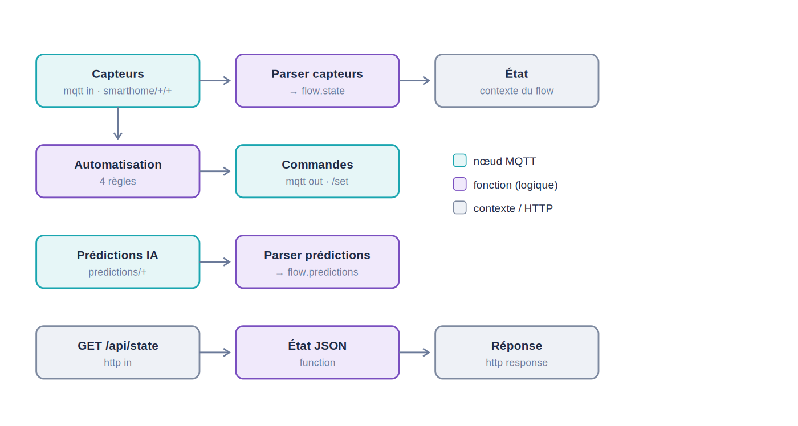
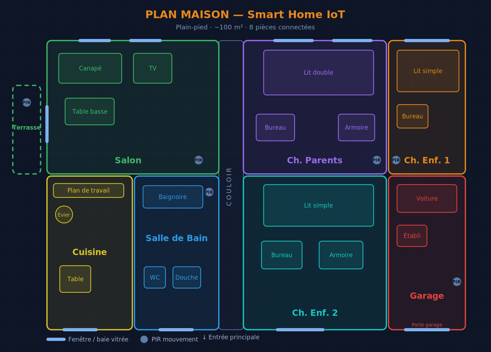
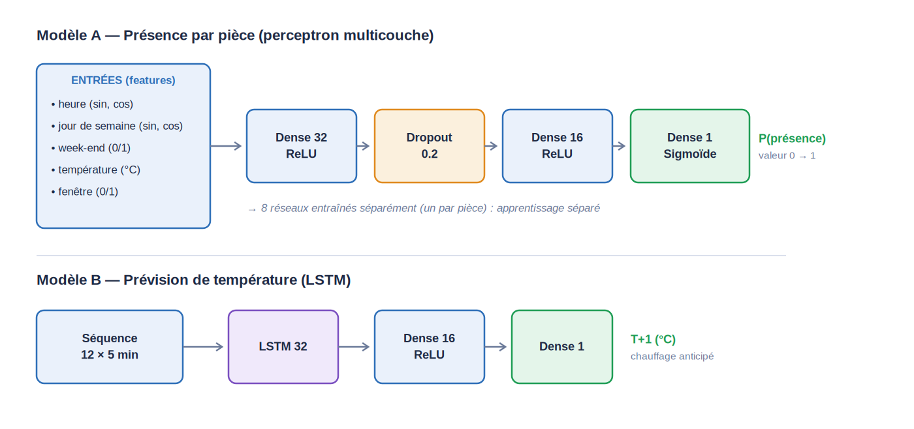

# 🏠 Smart Home — Module IA & Poste d'Exploitation

> Partie **Intelligence Artificielle (PC Maintenance)** et **Poste d'Exploitation (Node-RED + Dashboard)** du projet domotique *Tablette Domotique Intelligente* (CNAM).


Ce dépôt regroupe deux postes d'un système domotique IoT :

- **PC Maintenance — IA (Google Colab).** Des réseaux de neurones apprennent les habitudes de la maison (température, présence, lumière, état des fenêtres) pour **prédire** des déclencheurs d'automatisation : éclairage anticipé, chauffage avant la baisse de température, routine café du matin…
- **PC Exploitation — Node-RED + Dashboard HUD.** Le poste administrateur : il centralise la télémétrie, exécute l'automatisation, exploite les prédictions de l'IA et présente un tableau de bord web temps réel avec le plan de la maison.

La communication passe par **MQTT TLS via HiveMQ Cloud**.

---

## 🧭 Architecture

```
   ESP32 / TAB5 ──MQTT TLS:8883──┐
                                 ▼
                          ┌─────────────┐
                          │ HiveMQ Cloud│  (bus de messages)
                          └─────────────┘
        TLS:8883 ▲          ▲ TLS:8883        ▲ WSS:8884
                 │          │                 │
        ┌────────┘   ┌──────┘                 └────────┐
        ▼            ▼                                  ▼
  ┌───────────┐ ┌───────────┐                    ┌───────────┐
  │  Colab IA │ │  Node-RED │  sert / pilote      │  HUD web  │
  │(prédiction)│ │ (cerveau) │ ──────────────────►│ (la face) │
  └───────────┘ └───────────┘                    └───────────┘
```



---

## 📂 Structure du dépôt

```
smart-home-ia-exploitation/
├── ia-colab/            # Module IA — notebook Google Colab
│   ├── SmartHome_IA_Colab.ipynb
│   └── README.md
├── node-red/            # Flux Node-RED (cerveau / automatisation)
│   ├── flows.json
│   └── README.md
├── dashboard-hud/       # Tableau de bord web (plan de la maison)
│   ├── index.html
│   └── README.md
├── docs/                # Figures et plan
│   ├── plan_maison.png / .svg
│   ├── architecture_reseau_neurones.png
│   └── schema_flux_node-red.png
├── rapport/             # Rapport (ma partie)
├── .env.example         # Modèle d'identifiants
├── Programme tab5
├── Programme test esp32 #test communication entre la tab5 et l'esp32 à l'aide d'une led
├── .gitignore
└── LICENSE
```

---

## 🔌 Contrat MQTT

| Topic | Sens | Payload |
|---|---|---|
| `smarthome/<piece>/temperature` | terrain → tous | nombre (°C) |
| `smarthome/<piece>/presence` | terrain → tous | `0` / `1` |
| `smarthome/<piece>/light` | terrain → tous | `0` / `1` |
| `smarthome/<piece>/window` | terrain → tous | `0` (fermée) / `1` (ouverte) |
| `smarthome/predictions/<piece>` | Colab → Node-RED + HUD | JSON `{"activity_prob":0.83,"temp_next":21.9}` |
| `smarthome/<piece>/light/set` · `heating/set` · `coffee/set` | Node-RED → terrain | commande |
| `smarthome/alerts` | Node-RED → HUD | JSON alerte |
| `smarthome/config/sensors` | HUD → Node-RED | JSON registre (retenu) |
| `smarthome/mode` | HUD → Node-RED | `present` / `away` |

`<piece>` ∈ `salon`, `cuisine`, `sdb`, `chparents`, `chenf1`, `chenf2`, `garage`, `terrasse`.

---

## 🚀 Démarrage rapide

Chaque module a son propre guide détaillé. En résumé :

1. **Dashboard HUD** — ouvre `dashboard-hud/index.html` dans un navigateur : il démarre en **mode démo** (données simulées) et le plan s'anime immédiatement. → [guide](dashboard-hud/README.md)
2. **IA (Colab)** — importe `ia-colab/SmartHome_IA_Colab.ipynb` dans Google Colab et exécute les cellules dans l'ordre. → [guide](ia-colab/README.md)
3. **Node-RED** — importe `node-red/flows.json` dans Node-RED. → [guide](node-red/README.md)

---

## 🔑 Configuration (identifiants HiveMQ)

> ⚠️ **Aucun identifiant n'est versionné dans ce dépôt.** Les fichiers contiennent des valeurs fictives (`VOTRE_USER`, `VOTRE_MOT_DE_PASSE`, `VOTRE-CLUSTER…`).

Renseigne tes identifiants HiveMQ Cloud à ces endroits :

| Module | Où |
|---|---|
| Notebook Colab | cellule **2. Configuration** (`HIVEMQ_HOST` / `HIVEMQ_USER` / `HIVEMQ_PASS`) |
| Dashboard HUD | en haut de `index.html` (`const HMQ = …`) **ou** via le bouton ⚙ de connexion dans l'interface |
| Node-RED | nœud broker *HiveMQ Cloud* (onglets *Connection* / *Security*) |

Le fichier [`.env.example`](.env.example) liste les variables attendues. Ne committe jamais tes vrais identifiants.

---

## 🖼️ Aperçu

Plan de la maison reproduit dans le tableau de bord (8 pièces, données par pièce en temps réel) :



Architecture des réseaux de neurones (présence par pièce + prévision de température) :



---

## 🗂️ Traçabilité des versions

| Artefact | Version | Date | Modifications |
|---|---|---|---|
| IA (Colab) | V1.0 | Juin 2026 | Création du pipeline : collecte MQTT, données synthétiques, modèles de présence + LSTM, publication des prédictions (4 pièces). |
| IA (Colab) | **V2.0** | Juin 2026 | Plan réel 8 pièces ; capteurs température / présence / lumière / fenêtre ; générateur et modèles adaptés. |
| Poste d'exploitation | V1.0 | Juin 2026 | Flux Node-RED + dashboard HUD (plan, capteurs, données, IA). |
| Poste d'exploitation | **V2.0** | Juin 2026 | Plan 8 pièces reproduit ; 4 données en direct ; ajout de capteur depuis le site. |

---

## 👤 Auteur & contexte

Projet académique — **CNAM**, juin 2026.
Équipe complète : Alexis (TAB5), Rayan (ESP32), Devran (IA / Node-RED), Pierre (architecture / HiveMQ).

## 📄 Licence

Distribué sous licence **MIT**. Voir [`LICENSE`](LICENSE).
